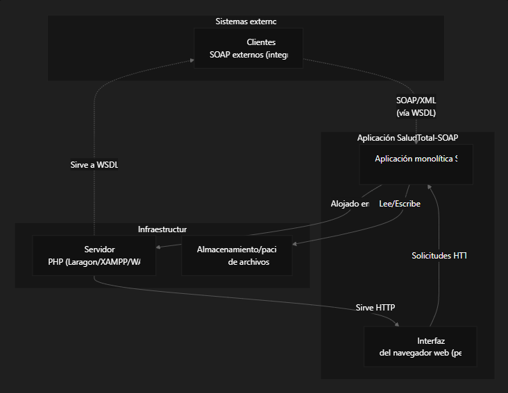
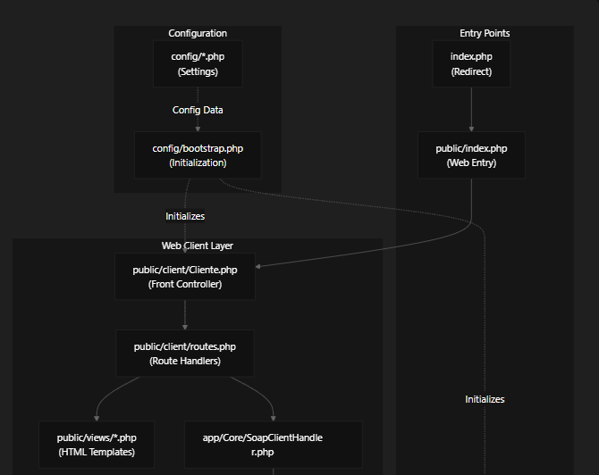
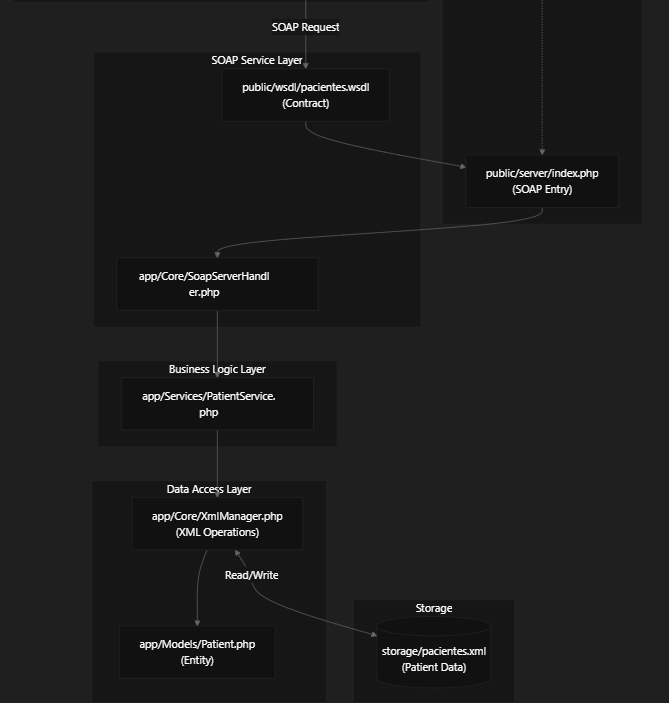
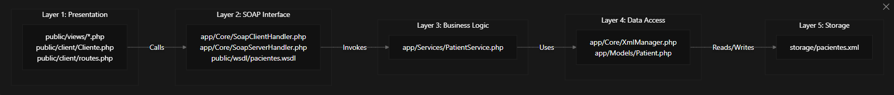
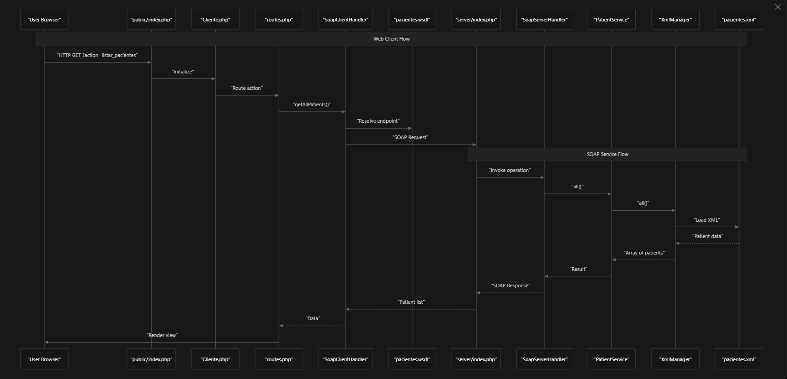
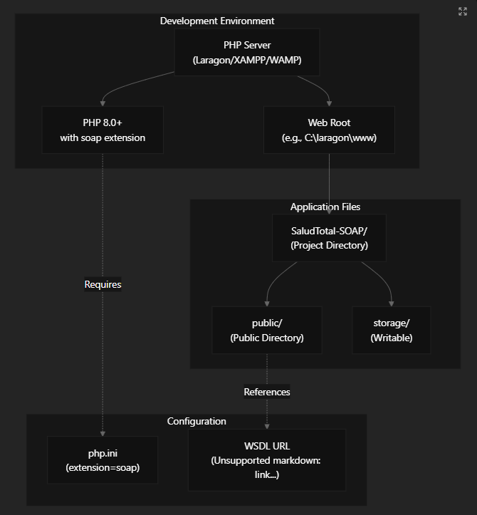

# SaludTotal-SOAP 🩺

Sistema de gestión de pacientes para la **Clínica SaludTotal**, basado en una arquitectura de **servicios web SOAP**.  
Incluye:

- Operaciones CRUD completas sobre pacientes.
- Servidor SOAP con contrato WSDL público.
- Cliente web interno para uso del personal de la clínica.
- Persistencia de datos en archivo XML.

> Proyecto académico / prototipo técnico orientado a demostrar una arquitectura SOAP bien estructurada.

---

## 📚 Tabla de contenido

1. [Propósito y alcance](#-propósito-y-alcance)
2. [Contexto del sistema](#-contexto-del-sistema)
3. [Pila tecnológica](#-pila-tecnológica)
4. [Arquitectura de alto nivel](#-arquitectura-de-alto-nivel)
5. [Capas del sistema](#-capas-del-sistema)
6. [Componentes principales](#-componentes-principales)
7. [Flujo de solicitudes](#-flujo-de-solicitudes)
8. [Modelo de datos del paciente](#-modelo-de-datos-del-paciente)
9. [Cobertura de requisitos funcionales](#-cobertura-de-requisitos-funcionales)
10. [Arquitectura de despliegue](#-arquitectura-de-despliegue)
11. [Limitaciones actuales](#-limitaciones-actuales)
12. [Instalación rápida](#-instalación-rápida)
13. [Ejemplos de consumo SOAP](#-ejemplos-de-consumo-soap)
14. [Documentación relacionada](#-documentación-relacionada)

---

## 🎯 Propósito y alcance

**SaludTotal-SOAP** es un sistema de gestión de historias de pacientes para la clínica ficticia **“Clínica SaludTotal”**, diseñado para:

- Demostrar una arquitectura **SOAP** completa (WSDL + servidor + cliente).
- Exponer operaciones **CRUD** sobre pacientes:
  - Crear, listar, buscar por cédula, actualizar y eliminar.
- Ofrecer una interfaz web interna para:
  - Personal administrativo / recepcionista.
- Mantener la información persistida en un archivo XML (`storage/pacientes.xml`).

El sistema cubre los requerimientos funcionales **RF-01 a RF-10**, tanto en backend (servicio SOAP) como en frontend (flujos de usuario).

---

## 🌐 Contexto del sistema

El sistema funciona como una aplicación **PHP monolítica**:

- El personal de la clínica accede vía navegador web.
- El **cliente web** consume un **servidor SOAP** propio.
- El mismo servidor SOAP puede ser consumido por **otros sistemas externos** a través del contrato WSDL publicado en:

```text
public/wsdl/pacientes.wsdl
````

### Diagrama de contexto del sistema (UML)



---

## 🛠 Pila tecnológica

El sistema está construido sobre la siguiente pila:

| Capa           | Tecnología                       | Propósito                                       |
| -------------- | -------------------------------- | ----------------------------------------------- |
| Ejecución      | **PHP 8.0+**                     | Entorno de ejecución en el servidor             |
| Servicios web  | **ext-soap**                     | Implementación de SOAP en PHP                   |
| Protocolo      | **WSDL 1.1**                     | Definición del contrato de servicio             |
| Datos          | **XML**                          | Intercambio y persistencia de datos             |
| Frontend       | **HTML5, CSS3, JavaScript**      | UI web para el personal de la clínica           |
| Servidor       | **Apache/Nginx** (Laragon/XAMPP) | Servidor HTTP                                   |
| Almacenamiento | **Archivo XML**                  | Registro de pacientes (`storage/pacientes.xml`) |

**Extensiones PHP requeridas:**

* `soap`
* `xml`
* `simplexml`

---

## 🧱 Arquitectura de alto nivel

El diseño implementa una arquitectura de **doble capa** donde:

* Un **cliente web** consume su **propio servicio SOAP**.
* Se separa la lógica de presentación de la lógica de negocio (operaciones de servicio).

### Diagrama de arquitectura de componentes (UML)




La arquitectura se organiza en **5 capas** con responsabilidades claras:

1. Capa de Presentación (UI web)
2. Capa de Interfaz SOAP (cliente + servidor)
3. Capa de Lógica de Negocio
4. Capa de Acceso a Datos
5. Capa de Almacenamiento

---

## 🧬 Capas del sistema

### Diagrama de responsabilidad de capas (UML)



### Descripción de capas

**Capa 1 – Presentación**

* Gestiona las solicitudes HTTP y renderiza HTML.
* Enruta acciones del usuario.
* Archivos clave:

  * `public/index.php`
  * `public/client/Cliente.php`
  * `public/client/routes.php`
  * `public/views/*.php`
  * `public/assets/css/style.css`
  * `public/assets/js/{alerts.js, main.js}`

**Capa 2 – Interfaz SOAP**

* Expone y consume servicios SOAP.
* Implementación del servidor:

  * `app/Core/SoapServerHandler.php`
  * `public/server/index.php`
* Implementación del cliente:

  * `app/Core/SoapClientHandler.php`
* Contrato de servicio:

  * `public/wsdl/pacientes.wsdl`

**Capa 3 – Lógica de negocio**

* Reglas relacionadas con la gestión de pacientes.
* Orquestación de operaciones.
* Archivo principal:

  * `app/Services/PatientService.php`

**Capa 4 – Acceso a datos**

* Opera sobre el archivo XML.
* Encapsula lectura/escritura.
* Archivos:

  * `app/Core/XmlManager.php`
  * `app/Models/Patient.php`

**Capa 5 – Almacenamiento**

* Persistencia física:

  * `storage/pacientes.xml`

---

## 🧩 Componentes principales

### Mapa de implementación de componentes

| Componente                  | Ruta archivo                      | Clase / Rol principal    | Responsabilidad                            |
| --------------------------- | --------------------------------- | ------------------------ | ------------------------------------------ |
| Redirección raíz            | `index.php`                       | Script de redirección    | Redirige a `public/index.php`              |
| Punto de entrada web        | `public/index.php`                | Front controller HTTP    | Entrada principal de la app web            |
| Controlador delantero       | `public/client/Cliente.php`       | Cliente                  | Enrutamiento de acciones                   |
| Manejadores de rutas        | `public/client/routes.php`        | Closures de acción       | Llamar vistas y operaciones SOAP           |
| Cliente SOAP                | `app/Core/SoapClientHandler.php`  | `SoapClientHandler`      | Consumidor del servicio SOAP               |
| Entrada servidor SOAP       | `public/server/index.php`         | `SoapServer`             | Endpoint SOAP                              |
| Handler de operaciones      | `app/Core/SoapServerHandler.php`  | `SoapServerHandler`      | Implementación de operaciones del servidor |
| Contrato WSDL               | `public/wsdl/pacientes.wsdl`      | Definición XML           | Interfaz de servicio                       |
| Servicio de pacientes       | `app/Services/PatientService.php` | `PatientService`         | Lógica CRUD de pacientes                   |
| Acceso al XML               | `app/Core/XmlManager.php`         | `XmlManager`             | Lectura/escritura de `pacientes.xml`       |
| Modelo de entidad           | `app/Models/Patient.php`          | `Patient`                | Representación de la entidad Paciente      |
| Bootstrap / Configuración   | `config/bootstrap.php`            | Script de inicialización | Autoload, constantes, helpers              |
| Almacenamiento de pacientes | `storage/pacientes.xml`           | XML                      | Persistencia de datos                      |

---

## 🔁 Flujo de solicitudes

El sistema soporta **dos flujos principales**:

1. **Flujo interno (web)**
   Navegador → `public/index.php` → `Cliente.php` → `SoapClientHandler` → Servidor SOAP → `PatientService` → `XmlManager` → XML.

2. **Flujo externo (SOAP)**
   Cliente externo → `public/server/index.php` (endpoint SOAP) → `SoapServerHandler` → `PatientService` → `XmlManager` → XML.

### Diagrama de flujo de solicitud dual (UML)



---

## 📄 Modelo de datos del paciente

Los registros de pacientes siguen la estructura:

| Campo              | Tipo                | Descripción                                  | Obligatorio |
| ------------------ | ------------------- | -------------------------------------------- | ----------- |
| `cedula`           | string              | Número de identificación nacional (ID único) | ✅           |
| `nombres`          | string              | Nombre(s) del paciente                       | ✅           |
| `apellidos`        | string              | Apellidos del paciente                       | ✅           |
| `telefono`         | string              | Número de contacto                           | ✅           |
| `fecha_nacimiento` | string (YYYY-MM-DD) | Fecha de nacimiento del paciente             | ✅           |

* `cedula` funciona como **clave primaria lógica**.
* Todas las operaciones (consultar, actualizar, eliminar) dependen de la `cedula`.

---

## ✅ Cobertura de requisitos funcionales

El sistema implementa los siguientes **RF**:

| Requisito | Tipo     | Descripción                              | Implementación                                                           |
| --------- | -------- | ---------------------------------------- | ------------------------------------------------------------------------ |
| RF-01     | Backend  | Crear paciente                           | `SoapServerHandler::createPatient()` / `PatientService::createPatient()` |
| RF-02     | Backend  | Buscar paciente por cédula               | `SoapServerHandler::getPatientByCedula()`                                |
| RF-03     | Backend  | Listar todos los pacientes               | `SoapServerHandler::getAllPatients()`                                    |
| RF-04     | Backend  | Actualizar datos de un paciente          | `SoapServerHandler::updatePatient()`                                     |
| RF-05     | Backend  | Eliminar paciente                        | `SoapServerHandler::deletePatient()`                                     |
| RF-06     | Frontend | Página principal                         | Acción `home` en `routes.php`                                            |
| RF-07     | Frontend | Formulario de registro de pacientes      | Acción `crear_paciente` + vista `crear_paciente.php`                     |
| RF-08     | Frontend | Vista de lista de pacientes              | Acción `listar_pacientes` + vista `listar_pacientes.php`                 |
| RF-09     | Frontend | Formulario de edición de paciente        | Acción `editar_paciente` + vista `editar_paciente.php`                   |
| RF-10     | Frontend | Eliminación de paciente vía confirmación | Acción `eliminar_paciente` + diálogos JS                                 |

---

## 🚀 Arquitectura de despliegue

Requisitos básicos de despliegue:

* **PHP 8.0+** con extensión `soap` habilitada.
* Servidor web local (Laragon, XAMPP, etc.).
* Permisos de escritura sobre `storage/pacientes.xml`.

Pasos generales:

1. Clonar o copiar el proyecto en el docroot, por ejemplo:
   `C:\laragon\www\SaludTotal-SOAP`
2. Verificar que `storage/pacientes.xml` tenga permisos de escritura.
3. Configurar la URL del endpoint SOAP en `public/wsdl/pacientes.wsdl`.
4. Acceder desde el navegador a:
   `http://localhost/SaludTotal-SOAP/public/index.php`

### Diagrama de despliegue (UML)



---

## ⚠ Limitaciones actuales

Este sistema está pensado como **prototipo/ejemplo académico**, y tiene las siguientes limitaciones:

* **Almacenamiento en archivo XML**:

  * No es ideal para alta concurrencia ni grandes volúmenes de datos.
* **Sin autenticación**:

  * No hay login, roles ni permisos implementados.
* **Bloqueo de archivo XML**:

  * Bajo muchas solicitudes concurrentes pueden aparecer condiciones de carrera.
* **Despliegue local**:

  * Diseñado para correr principalmente en entornos de desarrollo (Laragon/XAMPP).
* **Arquitectura monolítica**:

  * Todos los componentes residen en una sola app PHP.

---

## 🧪 Instalación rápida

Para ver todos los pasos detallados, revisa:

* [`docs/INSTALACION.md`](docs/INSTALACION.md)

Resumen ultra corto:

```bash
# 1. Clonar el proyecto
git clone <URL_DEL_REPO> SaludTotal-SOAP
cd SaludTotal-SOAP

# 2. Instalar dependencias PHP (si aplica)
composer install

# 3. Verificar SOAP habilitado en php.ini

# 4. Dar permisos de escritura a storage/pacientes.xml

# 5. Levantar servidor (ej. Laragon) y abrir:
#    http://localhost/SaludTotal-SOAP/public/index.php
```

---

## 📡 Ejemplos de consumo SOAP

Los ejemplos de cómo consumir el servicio desde un cliente PHP externo están documentados en:

* [`docs/ejemplos_consumo.md`](docs/ejemplos_consumo.md)

Incluye snippets para:

* Cliente SOAP en PHP consumiendo `pacientes.wsdl`.
* Llamadas a:

  * `createPatient`
  * `getPatientByCedula`
  * `getAllPatients`
  * `updatePatient`
  * `deletePatient`

---

## 📎 Documentación relacionada

* **Instalación y configuración detallada**
  [`docs/INSTALACION.md`](docs/INSTALACION.md)

* **Arquitectura del sistema (detalle por capas)**
  [`docs/arquitectura.md`](docs/arquitectura.md)

* **Ejemplos de consumo del servicio SOAP**
  [`docs/ejemplos_consumo.md`](docs/ejemplos_consumo.md)

* **Contrato WSDL**
  `public/wsdl/pacientes.wsdl`

```